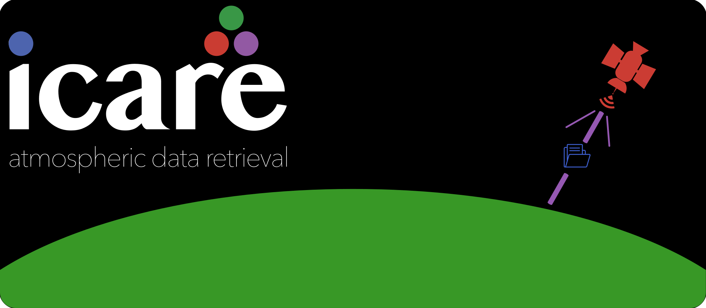

ICARE.jl
========



A Julia package for retrieving data from the
[AERIS/ICARE server](https://www.icare.univ-lille1.fr/).

| **Release** | **Documentation**                                                                  | **Build Status**                                                          |
|:----------------------------------------------------------------------------------:|:-------------------------------------------------------------------------:|:---:|
| <a href="https://github.com/LIM-AeroCloud/ICARE.jl/releases/tag/v0.7.0"></a> | [![Stable][docs-stable-img]][docs-stable-url] [![Dev][docs-dev-img]][docs-dev-url] | [![Build Status][CI-img]][CI-url] |

Use function `sftp_download` to retrieve missing data files in a specified time frame.
Routines are developed to retrieve CALIOP aerosol and cloud data, but will work for any
data with a folder structure of years and dates like this: `yyyy/yyyy_mm_dd`.

License
-------

The code is free to use under the GPL3 license. However, binaries included for the conversion
of HDF4 to HDF5 files are available under szip license for non-commercial, scientific use only.

Installation
------------

ICARE.jl is an unregistered Julia package, but can be installed with the package manager. It
also includes an unregistered dependency `SFTP.jl`, which needs to be install first.

```julia
julia> ]
pkg> add https://github.com/LIM-AeroCloud/SFTP.jl.git
pkg> add https://github.com/LIM-AeroCloud/ICARE.jl.git
pkg> ← (backspace)
julia> using ICARE
```

SFTP download
-------------

```julia
function sftp_download(
    user::AbstractString,
    password::AbstractString,
    product::AbstractString,
    startdate::Int,
    enddate::Int=-1;
    version::Union{Nothing,Real} = 4.51,
    remoteroot::AbstractString = "/SPACEBORNE/CALIOP/",
    localroot::AbstractString = ".",
    convert::Bool = true,
    resync::Bool = false,
    update::Bool = false,
    logfile::AbstractString = "downloads.log",
    loglevel::Symbol = :Debug
)::SortedDict
```

Download missing CALIOP hdf files for the given `product` (e.g., `"05kmAPro"` or `"01kmCLay"`)
and `version` (e.g., `4.51` or `5`, default is `4.51`) from the ICARE server
using your `user` login name and `password`.

Data is downloaded for the specified time frame in the range `startdate` to `enddate`;
`startdate` and `enddate` are positive integers in the date format `"yyyymmdd"`.
Months (`"mm"`) or month and days (`"mmdd"`) can be missing and are substituted with the first
possible date for the `startdate` and last possible date for the `enddate`.
If `enddate` is not specified, data is downloaded for the given range of the `startdate`,
i.e. one year, month or day of data.

**Examples:**

- startdate = `2010`: download all data available in 2010 (from 2010-01-01 to 2010-12-31)
- startdate = `201001`: download all data from January 2010 (from 2010-01-01 to 2010-01-31)
- startdate = `20100101`: download data only for 2010-01-01
- startdate, enddate = `2010, 201006`: download first half of 2010 (from 2010-01-01 to 2010-06-30)
- startdate, enddate = `20100103, 20100105`: download data from 2010-01-03 to 2010-01-05

### Data structure

Data are downloaded to a `localroot` directory. If the local root directory does not
exist, you are prompted to confirm it's creation or abort the download.
In the root folder the following folder structure will be used, missing folders are
automatically created:

- product folder (assumed in the format `<product>.v<major>.<minor>`)
  - year folder as `yyyy`
    - date folder as `yyyy_mm_dd`

Hence, the folder structure of the Aeris/ICARE server will be synced and data files
are downloaded to the respective date folders.

You may enforce an update of newer versions of a file on the server by setting
`update` to `true`.

### Logging

Download sessions are logged to a log file in addition to the progress bar for downloads
of each date. You can specify the directory and file name with the `logfile` keyword
argument. By default, all log files are written to the main folder of each `product`.
By passing a valid path (relative or absolute) within the `logfile` keyword, this position
can be changed as well as the file name, e.g. to save the log file in the parent folder of
your current directory, rename it to "CALIOPdownloads" and chang the extension to ".txt", use
`../CALIOPdownloads.txt`.

To all log files a timestamp will be added automatically in the format `yyyy_mm_dd_HH_MM_SS`.
All log files have the format `path/to/logfile_<timestamp>.ext`.
This has the advantage that names can be reused for several download sessions and the
standard file name does not have to be changed. One can also see, when files where last
downloaded from a glance.
The following levels exist and can be specified with the `loglevel` keyword as `Symbol`.
By default, all log messages are shown.

- `:Error`: Only errors (and severe warnings) are shown.
- `:Warn`: Warnings and errors are shown.
- `:Info`: Info messages are shown additionally.
- `:Debug`: All log messages are shown.

### Example script

```julia
import Pkg
Pkg.activate("/Users/home/ICARE")

using ICARE

# Download all data from the year 2010
localroot = "/Users/home/data/CALIOP/"
inventory = sftp_download(
    "user",
    "PassWord#1!",
    "05kmCPro",
    2010;
    localroot
)
```

Tools to analyse and manipulate the database
--------------------------------------------

Further routines exist, to `clean!` the database from any objects not listed in the inventory,
or for batch conversions of the downloaded files (default routines upgrade HDF4 to HDF5 files).
See, the [documentation][docs-stable-url] for more details.

[docs-stable-img]: https://img.shields.io/badge/docs-stable-blue.svg
[docs-stable-url]: https://LIM-AeroCloud.github.io/ICARE.jl/stable/

[docs-dev-img]: https://img.shields.io/badge/docs-dev-blue.svg
[docs-dev-url]: https://LIM-AeroCloud.github.io/ICARE.jl/dev/

[CI-img]: https://github.com/LIM-AeroCloud/ICARE.jl/actions/workflows/CI.yml/badge.svg?branch=dev
[CI-url]: https://github.com/LIM-AeroCloud/ICARE.jl/actions/workflows/CI.yml?query=branch%3Adev
